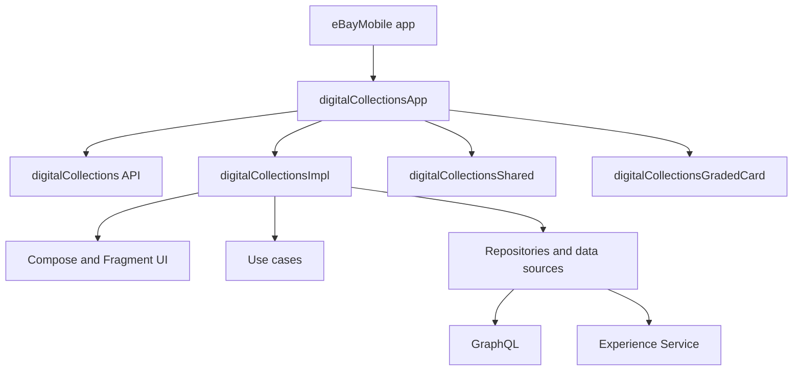

# Digital Collections Android Learning Hub

This is the learning index for the Android Digital Collections module. Use it as a map when you want to understand how the feature is structured, how screens are wired, how Dagger creates dependencies, and where data and tests live.

## Recommended Reading Order

1. [[Digital Collections Module Map]]
2. [[Digital Collections Navigation and Screen Flow]]
3. [[Digital Collections ViewModels and UDF]]
4. [[Digital Collections Dagger Assisted ViewModel Flow]]
5. [[Digital Collections Data Layer and APIs]]
6. [[Digital Collections Testing Strategy]]

Existing reference notes:

- [[Collectibles Architecture and Best Practices]]
- [[digitalcollection]]
- [[Collectible testing rules]]
- [[Deeplink]]

## Mental Model

Digital Collections is not one small feature. It is a feature area made of a public API module, app-level Dagger wiring, a large implementation module, shared UI helpers, graded-card functionality, and test-support modules.

The most useful way to reason about it is:



## Core Topics

### Module Architecture

Start with [[Digital Collections Module Map]] to understand the seven Gradle modules, what each module owns, and why `digitalCollectionsApp` is the app-facing integration point.

Key code paths:

- `digitalCollections/`
- `digitalCollections/digitalCollectionsApp/`
- `digitalCollections/digitalCollectionsImpl/`
- `digitalCollections/digitalCollectionsShared/`
- `digitalCollections/digitalCollectionsGradedCard/`
- `digitalCollections/digitalCollectionsTestSupport/`
- `digitalCollections/digitalCollectionsInternalTestHelper/`

### Navigation And Screens

Read [[Digital Collections Navigation and Screen Flow]] to understand the main UI stack:

```text
CollectibleActivity
    -> DigitalCollectionsNavigation
        -> CollectiblesContainer
            -> CollectiblesNavHost
                -> feature screen registration functions
```

This explains where screen routes are registered, how action bar and options menu state are bridged, and where Compose and legacy Fragment flows still coexist.

### ViewModels And State

Read [[Digital Collections ViewModels and UDF]] to understand the dominant screen pattern:

```text
ViewState + Event + Effect + UdfScaffold
```

This note also explains when Digital Collections uses the default Dagger `ViewModelProvider.Factory` versus assisted factories.

### Dagger And Assisted Injection

Read [[Digital Collections Dagger Assisted ViewModel Flow]] for a complete screen-level walkthrough using the Archive Collectible screen.

The short version:

```text
Dagger provides stable dependencies.
The screen provides runtime inputs.
The assisted factory combines them.
```

### Data And APIs

Read [[Digital Collections Data Layer and APIs]] to understand:

- repository and data source layering
- GraphQL versus Experience Service boundaries
- use case placement
- price guidance data providers
- hybrid migration areas

### Testing

Read [[Digital Collections Testing Strategy]] for the testing stack:

- unit tests
- Robolectric
- MockK
- Turbine
- Dagger `TestComponent`
- androidTest fake modules
- public versus internal test-support modules

## Important Source References

Canonical architecture docs:

- `digitalCollections/docs/CollectiblesArchitectureAndBestPractices.md`
- `digitalCollections/digitalCollectionsImpl/docs/DecorToScaffoldDataBuilderMigration.md`

Core UI and navigation:

- `digitalCollections/digitalCollectionsImpl/src/main/java/com/ebay/mobile/digitalcollections/impl/view/CollectibleActivity.kt`
- `digitalCollections/digitalCollectionsImpl/src/main/java/com/ebay/mobile/digitalcollections/impl/navigation/DigitalCollectionsNavigation.kt`
- `digitalCollections/digitalCollectionsImpl/src/main/java/com/ebay/mobile/digitalcollections/impl/view/navigation/CollectiblesNavHost.kt`

Dagger:

- `digitalCollections/digitalCollectionsImpl/src/main/java/com/ebay/mobile/digitalcollections/impl/dagger/DigitalCollectionsApplicationModule.kt`
- `digitalCollections/digitalCollectionsImpl/src/main/java/com/ebay/mobile/digitalcollections/impl/dagger/DigitalCollectionsActivityModule.kt`
- `digitalCollections/digitalCollectionsImpl/src/main/java/com/ebay/mobile/digitalcollections/impl/dagger/DigitalCollectionsApiModule.kt`
- `digitalCollections/digitalCollectionsImpl/src/main/java/com/ebay/mobile/digitalcollections/impl/dagger/DigitalCollectionsUseCaseModule.kt`

ViewModel factory facade:

- `digitalCollections/digitalCollectionsImpl/src/main/java/com/ebay/mobile/digitalcollections/impl/viewmodel/DigitalCollectionsViewModelFactory.kt`

## Current Architecture Themes

- Digital Collections follows layered Android architecture: UI, domain, and data.
- Compose is the primary direction, but several legacy Fragment flows still exist.
- Most screens follow UDF-style state handling through `UdfScaffold`.
- Dagger Android is still used, not Hilt.
- Some ViewModels use default Dagger multibinding; others use `@AssistedInject` for runtime route args.
- Data access is split between GraphQL, Experience Service, and feature-specific APIs.
- UPG and price guidance functionality is gradually moving toward reusable business components.

## Common Gotchas

- `CollectibleActivity.kt` contains the `DigitalCollectionsActivity` class name; the file name is legacy.
- Some docs mention `CollectiblesScaffold`, while current code commonly uses `UdfScaffold`.
- `digitalCollectionsImpl` is large and contains both old and new patterns.
- Not every ViewModel should be added to `DigitalCollectionsViewModelFactory`; default factory and assisted factory usage depend on constructor needs.
- Some screen state is still hoisted at the navigation layer; `DigitalCollectionsNavigation.kt` has a TODO to move more ViewModels to individual destinations.

