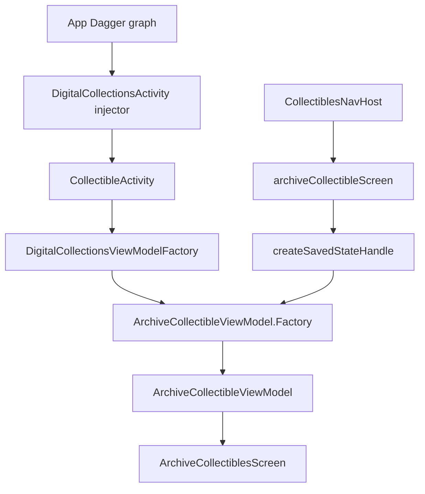

# Digital Collections Dagger Assisted ViewModel Flow

Back to [[Digital Collections Android Learning Hub]].

This note walks through one complete Dagger flow in the Digital Collections module using the Archive Collectible / Mark as Sold screen.

The main idea:

- Dagger creates and injects `CollectibleActivity`.
- The activity receives a `DigitalCollectionsViewModelFactory`.
- That factory exposes the Dagger-generated `ArchiveCollectibleViewModel.Factory`.
- Compose navigation creates a `SavedStateHandle` at runtime.
- The assisted factory combines the runtime `SavedStateHandle` with Dagger-provided dependencies to create `ArchiveCollectibleViewModel`.

## Flow



## 1. Dagger Registers The Activity

File:

`digitalCollections/digitalCollectionsImpl/src/main/java/com/ebay/mobile/digitalcollections/impl/dagger/DigitalCollectionsApplicationModule.kt`

```kotlin
@Module
abstract class DigitalCollectionsApplicationModule {
    @ActivityScope
    @ContributesAndroidInjector(modules = [DigitalCollectionsActivityModule::class])
    abstract fun contributeDigitalCollectionsActivity(): DigitalCollectionsActivity
}
```

`@ContributesAndroidInjector` tells Dagger Android to generate the subcomponent that knows how to inject `DigitalCollectionsActivity`.

The important part is the module list:

```kotlin
modules = [DigitalCollectionsActivityModule::class]
```

That means bindings in `DigitalCollectionsActivityModule` are available inside the activity graph.

## 2. The Activity Performs Injection

File:

`digitalCollections/digitalCollectionsImpl/src/main/java/com/ebay/mobile/digitalcollections/impl/view/CollectibleActivity.kt`

```kotlin
override fun onCreate(savedInstanceState: Bundle?) {
    AndroidInjection.inject(this)
    super.onCreate(savedInstanceState)
}
```

Injection happens before `super.onCreate(...)`, so injected fields are ready before the activity starts using them.

One of those injected fields is:

```kotlin
@Inject
lateinit var viewModelFactory: DigitalCollectionsViewModelFactory
```

This is not the generated assisted factory itself. It is a local facade that groups multiple ViewModel factories used by Digital Collections.

## 3. Dagger Binds The Factory Facade

File:

`digitalCollections/digitalCollectionsImpl/src/main/java/com/ebay/mobile/digitalcollections/impl/dagger/DigitalCollectionsActivityModule.kt`

```kotlin
@Binds
abstract fun bindDigitalCollectionsViewModelFactory(
    impl: DigitalCollectionsViewModelFactoryImpl
): DigitalCollectionsViewModelFactory
```

This binding means:

When something asks Dagger for `DigitalCollectionsViewModelFactory`, provide `DigitalCollectionsViewModelFactoryImpl`.

## 4. Dagger Constructs The Factory Facade

File:

`digitalCollections/digitalCollectionsImpl/src/main/java/com/ebay/mobile/digitalcollections/impl/viewmodel/DigitalCollectionsViewModelFactory.kt`

```kotlin
interface DigitalCollectionsViewModelFactory {
    val default: ViewModelProvider.Factory
    val archiveCollectibleViewModelFactory: ArchiveCollectibleViewModel.Factory
    val collectibleActivityViewModelFactory: CollectibleActivityViewModel.Factory
    val folderSelectionViewModelFactory: FolderSelectionViewModel.Factory
    val manualAddEditCollectibleViewModelFactory: ManualAddEditCollectibleViewModel.Factory
    val priceGuidanceDataProviderFactory: CollectibleItemPriceGuidanceDataProvider.Factory
    val notionalTypeSelectionViewModelFactory: NotionalTypeSelectionViewModel.Factory
    val createRenameFolderViewModelFactory: CreateRenameFolderViewModel.Factory
}
```

```kotlin
class DigitalCollectionsViewModelFactoryImpl @Inject constructor(
    override val default: ViewModelProvider.Factory,
    override val archiveCollectibleViewModelFactory: ArchiveCollectibleViewModel.Factory,
    override val collectibleActivityViewModelFactory: CollectibleActivityViewModel.Factory,
    override val folderSelectionViewModelFactory: FolderSelectionViewModel.Factory,
    override val manualAddEditCollectibleViewModelFactory: ManualAddEditCollectibleViewModel.Factory,
    override val priceGuidanceDataProviderFactory: CollectibleItemPriceGuidanceDataProvider.Factory,
    override val notionalTypeSelectionViewModelFactory: NotionalTypeSelectionViewModel.Factory,
    override val createRenameFolderViewModelFactory: CreateRenameFolderViewModel.Factory,
) : DigitalCollectionsViewModelFactory
```

The `@Inject constructor` tells Dagger how to build `DigitalCollectionsViewModelFactoryImpl`.

Most of the constructor parameters are factories. For example:

```kotlin
ArchiveCollectibleViewModel.Factory
```

Dagger can provide this factory because `ArchiveCollectibleViewModel` declares an `@AssistedFactory`.

## 5. The Activity Passes The Factory Into Compose

File:

`digitalCollections/digitalCollectionsImpl/src/main/java/com/ebay/mobile/digitalcollections/impl/view/CollectibleActivity.kt`

```kotlin
DigitalCollectionsNavigation(
    viewModelFactory = viewModelFactory,
    activityViewModel = activityViewModel,
    tabHostViewModel = tabHostViewModel,
    startDestination = startDestination,
    navController = navHostController,
    unifiedPriceGuidanceFactory = unifiedPriceGuidanceFactory,
    // ...
)
```

At this point, Dagger is no longer directly involved. The already-injected object is being passed through Compose function parameters.

## 6. Navigation Selects The Archive Factory

File:

`digitalCollections/digitalCollectionsImpl/src/main/java/com/ebay/mobile/digitalcollections/impl/view/navigation/CollectiblesNavHost.kt`

```kotlin
archiveCollectibleScreen(
    viewModelFactory = viewModelFactory.archiveCollectibleViewModelFactory,
    navHostController = navHostController,
    showCollectiblesSnackBar = showCollectiblesSnackBar,
)
```

The archive screen does not receive the whole `DigitalCollectionsViewModelFactory`. It receives only:

```kotlin
ArchiveCollectibleViewModel.Factory
```

That keeps the destination focused on the factory it actually needs.

## 7. The Archive Destination Creates The ViewModel

File:

`digitalCollections/digitalCollectionsImpl/src/main/java/com/ebay/mobile/digitalcollections/impl/view/composables/archive/ArchiveCollectiblesNavigation.kt`

```kotlin
val viewModel = viewModel {
    viewModelFactory.create(createSavedStateHandle())
}
```

This is the key assisted injection moment.

`createSavedStateHandle()` is runtime state from the navigation entry. Dagger cannot know that value when it builds the graph.

So the caller passes it into the assisted factory manually.

## 8. The ViewModel Declares Assisted And Dagger Dependencies

File:

`digitalCollections/digitalCollectionsImpl/src/main/java/com/ebay/mobile/digitalcollections/impl/viewmodel/archive/ArchiveCollectibleViewModel.kt`

```kotlin
class ArchiveCollectibleViewModel @AssistedInject constructor(
    @Assisted private val savedStateHandle: SavedStateHandle,
    private val coroutineDispatchers: CoroutineDispatchers,
    private val archiveOperationUseCase: ArchiveOperationUseCase,
    private val tracker: CollectibleTrackingHelper,
) : ViewModel()
```

This constructor has two kinds of dependencies.

Dagger-provided dependencies:

- `CoroutineDispatchers`
- `ArchiveOperationUseCase`
- `CollectibleTrackingHelper`

Caller-provided assisted dependency:

- `SavedStateHandle`

The `@Assisted` annotation marks the value that must be passed by the factory caller.

## 9. The Assisted Factory Defines The Runtime Input

Same file:

```kotlin
@AssistedFactory
interface Factory {
    fun create(
        savedStateHandle: SavedStateHandle
    ): ArchiveCollectibleViewModel
}
```

This tells Dagger to generate an implementation of `ArchiveCollectibleViewModel.Factory`.

The generated factory's job is basically:

```kotlin
fun create(savedStateHandle: SavedStateHandle): ArchiveCollectibleViewModel {
    return ArchiveCollectibleViewModel(
        savedStateHandle = savedStateHandle,
        coroutineDispatchers = daggerProvidedCoroutineDispatchers,
        archiveOperationUseCase = daggerProvidedArchiveOperationUseCase,
        tracker = daggerProvidedTracker,
    )
}
```

You do not write that implementation manually. Dagger generates it.

## 10. The ViewModel Reads Navigation Args

The reason this ViewModel needs `SavedStateHandle` is that the archive screen is launched with route data:

File:

`digitalCollections/digitalCollectionsImpl/src/main/java/com/ebay/mobile/digitalcollections/impl/view/composables/archive/ArchiveCollectiblesNavigation.kt`

```kotlin
@Serializable
data class ArchiveCollectibleRoute(
    val collectibles: List<ArchiveCollectibleSeedData>
)
```

The ViewModel reads that route from the `SavedStateHandle`:

```kotlin
cards = savedStateHandle
    .toRoute<ArchiveCollectibleRoute>(typeMap = ArchiveCollectibleRoute.typeMap)
    .toViewState()
```

So the complete screen-specific data flow is:

```text
navController.navigate(ArchiveCollectibleRoute(...))
    -> navigation back stack stores route args
    -> createSavedStateHandle()
    -> ArchiveCollectibleViewModel.Factory.create(savedStateHandle)
    -> ArchiveCollectibleViewModel reads ArchiveCollectibleRoute from SavedStateHandle
```

## Default ViewModel Factory vs Assisted Factory

Digital Collections uses both patterns.

### Default Dagger ViewModel factory

Used when the ViewModel can be fully created by Dagger.

Example from `DigitalCollectionsActivityModule.kt`:

```kotlin
@[Binds IntoMap ViewModelKey(TabHostViewModel::class)]
abstract fun bindsTabHostViewModel(instance: TabHostViewModel): ViewModel
```

Then Compose or Activity code can use:

```kotlin
viewModel(factory = viewModelFactory.default)
```

Use this when all constructor dependencies are available from Dagger.

### Assisted ViewModel factory

Used when the ViewModel needs runtime values.

Example:

```kotlin
@Assisted private val savedStateHandle: SavedStateHandle
```

Then the caller must use:

```kotlin
viewModelFactory.create(createSavedStateHandle())
```

Use this when the constructor needs values that Dagger cannot provide at graph creation time, such as:

- navigation arguments
- screen-specific runtime input
- objects created from a back stack entry
- data passed from another feature at runtime

## Mental Model

Think of Dagger as owning stable dependencies:

```text
repositories, use cases, dispatchers, trackers, formatters, services
```

Think of assisted injection as owning runtime screen inputs:

```text
SavedStateHandle, nav args, selected item ids, feature-provided data providers
```

For `ArchiveCollectibleViewModel`, Dagger says:

I know how to provide `CoroutineDispatchers`, `ArchiveOperationUseCase`, and `CollectibleTrackingHelper`.

The screen says:

I know the current `SavedStateHandle`.

The assisted factory combines both.

