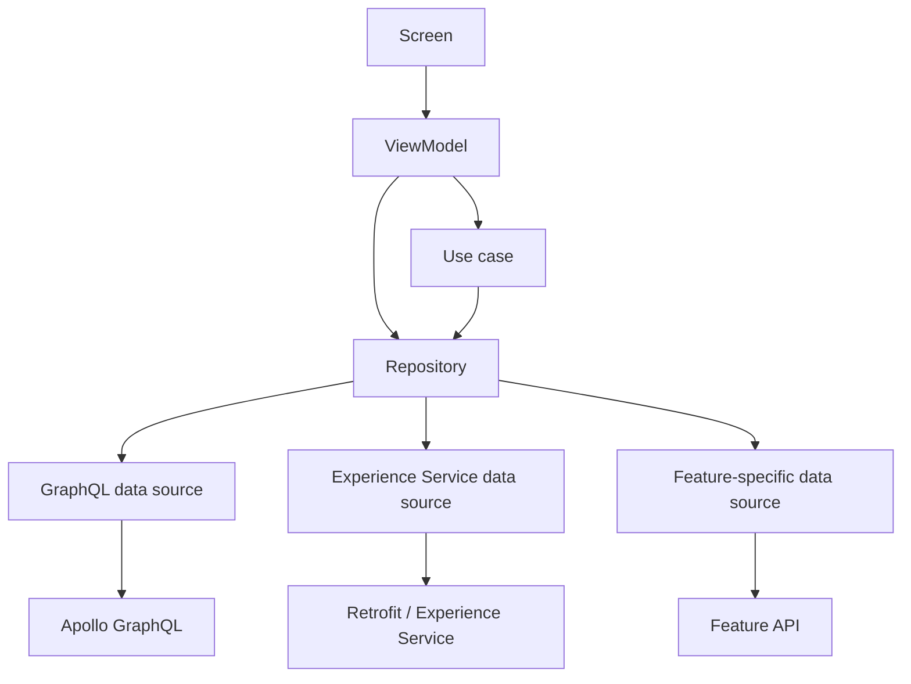

# Digital Collections Data Layer and APIs

Back to [[Digital Collections Android Learning Hub]].

Related notes:

- [[Digital Collections Module Map]]
- [[Digital Collections ViewModels and UDF]]
- [[Collectibles Architecture and Best Practices]]

## Mental Model

Digital Collections data usually flows from UI to ViewModel, through optional use cases, into repositories, and then into data sources.



The simple rule:

```text
ViewModels ask for feature-ready data.
Repositories decide where data comes from.
Data sources talk to the network or platform API.
Use cases hold reusable business logic.
```

## Main Data Layer Files

Dagger wiring:

- `digitalCollections/digitalCollectionsImpl/src/main/java/com/ebay/mobile/digitalcollections/impl/dagger/DigitalCollectionsApiModule.kt`
- `digitalCollections/digitalCollectionsImpl/src/main/java/com/ebay/mobile/digitalcollections/impl/dagger/DigitalCollectionsUseCaseModule.kt`
- `digitalCollections/digitalCollectionsImpl/src/main/java/com/ebay/mobile/digitalcollections/impl/dagger/DigitalCollectionsAdapterModule.kt`

GraphQL boundary:

- `digitalCollections/digitalCollectionsImpl/src/main/java/com/ebay/mobile/digitalcollections/impl/api/datasource/CollectiblesGraphQlDataSource.kt`
- `digitalCollections/digitalCollectionsImpl/src/main/java/com/ebay/mobile/digitalcollections/impl/api/datasource/CollectiblesGraphQlDataSourceImpl.kt`

Experience Service boundary:

- `digitalCollections/digitalCollectionsImpl/src/main/java/com/ebay/mobile/digitalcollections/impl/api/CollectiblesExperienceServiceRepository.kt`
- `digitalCollections/digitalCollectionsImpl/src/main/java/com/ebay/mobile/digitalcollections/impl/api/expsvc/CollectionsRetrofitExpSvcDataSource.kt`
- `digitalCollections/digitalCollectionsImpl/src/main/java/com/ebay/mobile/digitalcollections/impl/api/expsvc/PriceGuidanceRetrofitExpSvcDataSource.kt`

Feature verticals:

- `digitalCollections/digitalCollectionsImpl/src/main/java/com/ebay/mobile/digitalcollections/impl/cashInTheAttic/`
- `digitalCollections/digitalCollectionsImpl/src/main/java/com/ebay/mobile/digitalcollections/impl/unifiedPriceGuidance/`
- `digitalCollections/digitalCollectionsImpl/src/main/java/com/ebay/mobile/digitalcollections/impl/listingPriceGuidance/`
- `digitalCollections/digitalCollectionsImpl/src/main/java/com/ebay/mobile/digitalcollections/impl/parallelDetails/`
- `digitalCollections/digitalCollectionsImpl/src/main/java/com/ebay/mobile/digitalcollections/impl/parallels/`
- `digitalCollections/digitalCollectionsGradedCard/`

## Layer Responsibilities

### ViewModel

The ViewModel should request data in terms the UI understands.

Examples:

- initialize screen state
- submit form actions
- convert repository results into `ViewState`
- emit one-time effects
- call use cases for domain operations

Avoid:

- raw Apollo model handling in the ViewModel
- direct Retrofit calls
- large transformation chains that belong in data/domain

### Use Case

Use cases hold reusable business logic or multi-step domain operations.

Examples:

- archive/unarchive operations
- bookmarking
- build bulk actions
- build carousel items
- price text formatting
- inventory refinements
- initialize manual edit form fields

Use case wiring lives mostly in:

`digitalCollections/digitalCollectionsImpl/src/main/java/com/ebay/mobile/digitalcollections/impl/dagger/DigitalCollectionsUseCaseModule.kt`

When to add a use case:

- multiple ViewModels need the same domain operation
- repository calls need orchestration
- logic is too meaningful to bury in a ViewModel
- behavior is testable without Android UI

When not to add a use case:

- the ViewModel only forwards one simple repository call
- the logic is only UI formatting for one screen
- the abstraction would hide rather than clarify behavior

### Repository

Repositories expose feature-ready data and hide source details.

They may:

- call one or more data sources
- transform raw data into domain models
- combine GraphQL and Experience Service results
- return `Flow<AsyncState<T>>`, `Outcome<T>`, or feature-specific result types

Common examples:

- `CollectionSummaryRepository`
- `CollectibleFolderRepository`
- `CollectibleItemRepository`
- `AddCollectibleRepository`
- `AddFromCatalogRepository`
- `CollectiblesExperienceServiceRepository`
- `CardSearchRepository`
- `ListingRepository`
- `ParallelsRepository`

### Data Source

Data sources talk to one concrete data source type.

Examples:

- Apollo GraphQL
- Retrofit Experience Service
- content management APIs
- IIHUB or possession APIs for CITA

Data source rule:

```text
Keep data sources close to the API details.
Keep repositories close to feature/domain details.
```

## GraphQL Boundary

Digital Collections uses GraphQL heavily for core collection operations.

Central GraphQL data source:

`CollectiblesGraphQlDataSource`

Common GraphQL-backed areas:

- collection summary
- folders
- item details
- search
- add from catalog
- notes
- delete item
- archive/unarchive mutations
- listing drafts
- notional types
- price guidance queries

Good fit for GraphQL:

- structured collection data
- mutations owned by collection APIs
- item/folder operations
- new or migrated feature paths

Common gotcha:

- Do not leak generated GraphQL models into UI state. Transform them into business/domain models first.

## Experience Service Boundary

Digital Collections still uses Experience Service for several legacy or content-driven flows.

Important pieces:

- `CollectiblesExperienceServiceRepository`
- `CollectionsRetrofitExpSvcDataSource`
- `PriceGuidanceRetrofitExpSvcDataSource`
- adapters in `DigitalCollectionsAdapterModule`
- Experience module models under `data/expsvcmodule/`

Common Experience Service-backed areas:

- manual add/edit legacy forms
- past purchases
- splash content
- collection settings
- legacy notional type categories
- some archive/mark-as-sold form data

Good fit for Experience Service:

- legacy forms already modeled as Experience modules
- server-driven UI/content modules
- flows not yet migrated to GraphQL

Common gotcha:

- Experience Service responses often need adapter layers before ViewModels can use them safely.

## Hybrid Repositories

Some repositories bridge old and new worlds.

Example mental model:

```text
CollectibleItemRepository
    -> GraphQL for item details and mutations
    -> Experience Service for legacy form/content needs
    -> adapters for server-driven response models
```

When reading hybrid repositories, ask:

- Which API owns the source of truth for this operation?
- Is this a legacy path, a migrated path, or both?
- Are raw API models transformed before reaching the ViewModel?
- Is the repository hiding API differences from callers?

## DataProvider Pattern

Price guidance surfaces often use data providers above repositories.

Examples:

- `CollectibleItemPriceGuidanceDataProvider`
- `ListingPriceGuidanceDataProvider`
- `ParallelsPriceGuidanceDataProvider`
- `CitaPriceGuidanceDataProvider`
- `PriceGuidanceBackedPriceInsightsDataProvider`

Mental model:

```text
UPG UI or ViewModel
    -> PriceGuidanceDataProvider
        -> feature repository/data source
            -> GraphQL/API
```

Use this pattern when one reusable UI/business component needs a common provider contract, but each host feature fetches data differently.

## GraphQL vs Experience Service Decision Guide

| Concern | Usually Look At |
| --- | --- |
| Collection summary | GraphQL |
| Folders | GraphQL |
| Item details | GraphQL |
| Search/add from catalog | GraphQL |
| Notes/delete/listing draft operations | GraphQL |
| Price guidance | GraphQL and UPG data providers |
| Manual add/edit legacy forms | Experience Service |
| Past purchases | Experience Service |
| Splash/settings content | Experience Service |
| CITA scan/match | feature-specific CITA APIs |
| Graded card insights | `digitalCollectionsGradedCard` GraphQL/data layer |

## When To Use This Pattern

Add a repository when:

- a ViewModel needs stable feature data
- API details need to be hidden
- data is shared by multiple ViewModels/use cases
- transformation or error handling is non-trivial

Add a data source when:

- code needs to talk to a concrete API
- API details should be isolated
- tests should mock the boundary below the repository

Add an adapter/transformer when:

- raw network models do not match domain needs
- Experience Service modules are too generic for UI usage
- generated GraphQL models should not escape the data layer

## Common Gotchas

- Do not let raw Apollo or Experience Service models spread into UI code.
- Do not add repository logic directly in a ViewModel for convenience.
- Check whether a feature is in migration before assuming one API boundary is the future state.
- Price guidance often has extra indirection because reusable UPG components need host-provided data.
- If a data flow has both GraphQL and Experience Service, document which operation uses which source.

