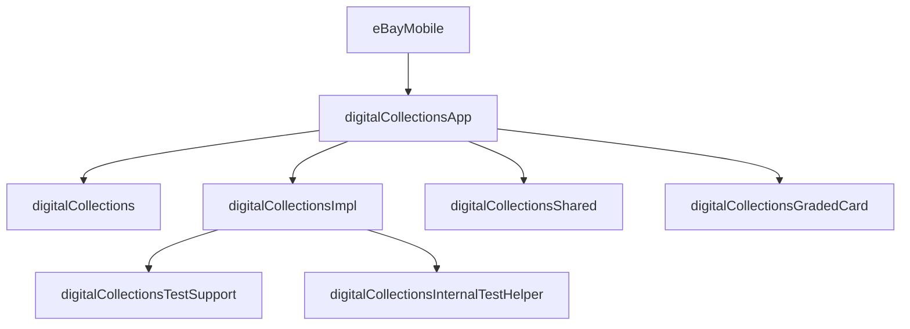

# Digital Collections Module Map

Back to [[Digital Collections Android Learning Hub]].

## Mental Model

Digital Collections is organized as a small public API plus a large implementation area. The app depends on the app wiring module, not directly on every implementation detail.



## Gradle Modules

| Module | Path | Role |
| --- | --- | --- |
| Public API | `digitalCollections/` | Public contracts, factories, shared models, and tracking types used by other modules. |
| App wiring | `digitalCollections/digitalCollectionsApp/` | Aggregates Dagger modules and exposes Digital Collections to the main app. |
| Implementation | `digitalCollections/digitalCollectionsImpl/` | Main feature implementation: UI, navigation, ViewModels, Dagger, repositories, data sources, use cases. |
| Shared | `digitalCollections/digitalCollectionsShared/` | Reusable Compose UI, camera helpers, shared utilities. |
| Graded Card | `digitalCollections/digitalCollectionsGradedCard/` | More isolated graded-card/card-insights feature area with its own data/UI/Dagger layers. |
| Test Support | `digitalCollections/digitalCollectionsTestSupport/` | Public fakes and stubs consumed by tests outside the implementation module. |
| Internal Test Helper | `digitalCollections/digitalCollectionsInternalTestHelper/` | Internal androidTest support, Dagger test modules, Espresso helpers, and test doubles. |

## Public API Module

Path:

`digitalCollections/src/main/java/com/ebay/mobile/digitalcollections/`

This module should stay small and stable. It contains contracts that other modules can depend on without knowing the implementation.

Important examples:

- `DigitalCollectionsFactory`
- `UnifiedPriceGuidanceFactory`
- `ListingPriceGuidanceFactory`
- `ShowGradedCardFactory`
- `PriceGuidanceEducationFactory`
- `ParallelDetailsIntentFactory`
- `UpgGradeComparisonFilterFactory`
- shared models under `components/`
- tracking model `DcTrackingAsset`

When to use this module:

- You need an entry point into Digital Collections from outside the feature.
- You need a public model shared by host code or business components.
- You need a factory contract without exposing implementation classes.

Common gotcha:

- Do not add implementation Dagger modules or implementation-only UI classes to the API module by default.

## App Wiring Module

Path:

`digitalCollections/digitalCollectionsApp/`

This module is the integration layer. It pulls together API, implementation, graded card, shared UI, and feature Dagger modules.

Mental model:

```text
Main app depends on digitalCollectionsApp.
digitalCollectionsApp includes the real implementation modules.
```

Use this module for app-level aggregation, not feature business logic.

## Implementation Module

Path:

`digitalCollections/digitalCollectionsImpl/`

This is the large feature module. Most Digital Collections Android learning happens here.

Important areas:

- `dagger/`: production Dagger modules.
- `view/`: activities, fragments, Compose screens, and screen-level UI packages.
- `navigation/`: high-level Compose orchestration.
- `view/navigation/`: `CollectiblesNavHost`.
- `viewmodel/`: shared factory facade and some ViewModels.
- `data/`: domain-specific data models and repository/data source helpers.
- `api/`: implementation data contracts, GraphQL/Experience Service integration, adapters.
- `usecase/`: domain logic between ViewModels and repositories.
- feature packages such as `collectibleItemDetails/`, `inventoryGrid/`, `manualAddEdit/`, `cashInTheAttic/`, `unifiedPriceGuidance/`, `parallelDetails/`, `repacks/`.

Common gotcha:

- `digitalCollectionsImpl` contains several generations of architecture. Expect to see Compose navigation, Compose-in-Fragment, legacy fragments, GraphQL, Experience Service, and UPG business-component migration patterns side by side.

## Shared Module

Path:

`digitalCollections/digitalCollectionsShared/`

Use this for reusable UI or utility code that should not live in the big implementation module.

Typical contents:

- shared Compose UI primitives
- image/camera helpers
- small utility APIs
- preview helpers

Common gotcha:

- Shared code should not become a dumping ground for feature-specific logic. If only one screen uses it, it probably belongs in that screen or feature package.

## Graded Card Module

Path:

`digitalCollections/digitalCollectionsGradedCard/`

This module is a good example of a semi-extracted feature. It has its own package structure for UI, state, data, GraphQL, tracking, and Dagger.

Use it as a reference when learning how a vertical feature can be separated from the larger `digitalCollectionsImpl` module.

## Test Modules

### digitalCollectionsTestSupport

Path:

`digitalCollections/digitalCollectionsTestSupport/`

This contains public fakes and stubs for tests that need Digital Collections contracts without pulling in the real feature implementation.

Examples:

- fake UPG factories
- test support Dagger module
- grade comparison filter stubs

### digitalCollectionsInternalTestHelper

Path:

`digitalCollections/digitalCollectionsInternalTestHelper/`

This is internal test infrastructure for Digital Collections android tests.

Examples:

- Espresso helpers
- page-object utilities
- identity test modules
- image loader stubs
- test Dagger modules

## Dependency Direction

Prefer this direction:

```text
app -> digitalCollectionsApp -> API + Impl + Shared + GradedCard
Impl -> API + Shared + platform/business modules
Tests -> TestSupport/InternalTestHelper where appropriate
```

Avoid this direction:

```text
API -> Impl
Shared -> feature-specific Impl
Business components -> Digital Collections Impl
```

## When To Add Code Where

- Add public entry contracts to `digitalCollections/`.
- Add app aggregation and Dagger includes to `digitalCollectionsApp/`.
- Add real feature code to `digitalCollectionsImpl/`.
- Add reusable UI/utilities to `digitalCollectionsShared/`.
- Add graded-card-specific code to `digitalCollectionsGradedCard/`.
- Add public test fakes to `digitalCollectionsTestSupport/`.
- Add internal UI/integration test helpers to `digitalCollectionsInternalTestHelper/`.

## Common Gotchas

- The folder name is `digitalCollections`, while Kotlin packages use `digitalcollections`.
- `digitalCollectionsImpl` is not a clean single-architecture sample; it is a real evolving production module.
- Some UPG functionality is moving toward business components, so do not assume all price-guidance code should stay in Digital Collections long term.
- Dagger module placement matters: production bindings should usually live near implementation modules, not in the public API module.

