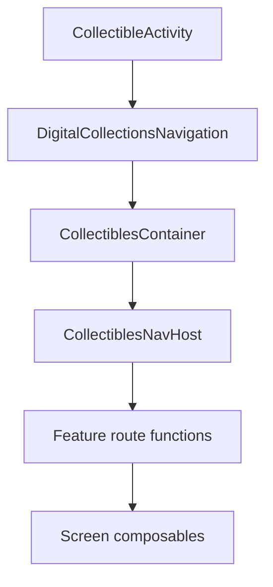

# Digital Collections Navigation and Screen Flow

Back to [[Digital Collections Android Learning Hub]].

## Mental Model

Digital Collections navigation is layered. The Activity owns Android lifecycle and app chrome, the navigation composable hoists shared state, and the NavHost registers individual feature destinations.



## Layer 1: Activity Shell

File:

`digitalCollections/digitalCollectionsImpl/src/main/java/com/ebay/mobile/digitalcollections/impl/view/CollectibleActivity.kt`

The file name is `CollectibleActivity.kt`, but the main class is `DigitalCollectionsActivity`.

Responsibilities:

- run `AndroidInjection.inject(this)`
- receive Dagger-injected factories and helpers
- create the `NavHostController`
- decide the start destination from launch params
- host the top-level `ComposeView`
- bridge action bar, options menu, bottom nav, camera permission, and external navigation

Important injected dependency:

```kotlin
@Inject
lateinit var viewModelFactory: DigitalCollectionsViewModelFactory
```

Important call:

```kotlin
DigitalCollectionsNavigation(
    viewModelFactory = viewModelFactory,
    activityViewModel = activityViewModel,
    tabHostViewModel = tabHostViewModel,
    startDestination = startDestination,
    navController = navHostController,
    // ...
)
```

When to look here:

- You need to understand app entry points.
- You need to debug start destination behavior.
- You need to trace action bar or options menu state.
- You need to understand which dependencies Dagger injects into the activity.

Common gotcha:

- This activity still supports some legacy Android patterns, including `HasAndroidInjector`, because some flows still use Fragments.

## Layer 2: Navigation Orchestration

File:

`digitalCollections/digitalCollectionsImpl/src/main/java/com/ebay/mobile/digitalcollections/impl/navigation/DigitalCollectionsNavigation.kt`

This composable sits between the Activity and the NavHost.

Responsibilities:

- create or hoist several activity-level ViewModels
- collect shared state with `collectAsStateWithLifecycle()`
- wire callbacks into `CollectiblesContainer`
- route snackbars, bottom sheets, quick edit, and menu events
- pass the needed factories and lambdas down to `CollectiblesNavHost`

Pattern:

```text
DigitalCollectionsNavigation
    -> creates/collects shared ViewModel state
    -> passes state and handlers into CollectiblesContainer
    -> renders CollectiblesNavHost inside the container content
```

Important note from the file:

```kotlin
// TODO: These viewmodels should be moved to their individual screens, and scoped to the individual destinations [NTVC-924].
```

That TODO explains a current architecture debt: some ViewModels are still hoisted higher than ideal.

When to look here:

- You need to trace how shared overlays work.
- You need to understand activity-scoped ViewModels.
- You need to see how screen callbacks become navigation actions.
- You need to identify state that should eventually move to destination scope.

## Layer 3: NavHost

File:

`digitalCollections/digitalCollectionsImpl/src/main/java/com/ebay/mobile/digitalcollections/impl/view/navigation/CollectiblesNavHost.kt`

This is the central Compose `NavHost`.

Responsibilities:

- register feature destinations
- pass each destination only the dependencies it needs
- pass state, event handlers, side-effect flows, and navigation callbacks
- connect route functions to the main app graph

Example:

```kotlin
archiveCollectibleScreen(
    viewModelFactory = viewModelFactory.archiveCollectibleViewModelFactory,
    navHostController = navHostController,
    showCollectiblesSnackBar = showCollectiblesSnackBar,
)
```

This tells you the Archive destination uses an assisted factory, not the default Dagger `ViewModelProvider.Factory`.

## Destination Registration Pattern

Most Compose destinations follow this shape:

```text
@Serializable Route
NavController.navigateToX(...)
NavGraphBuilder.xScreen(...)
private XScreenWrapper(...)
XScreen(...)
```

Example file:

`digitalCollections/digitalCollectionsImpl/src/main/java/com/ebay/mobile/digitalcollections/impl/view/composables/archive/ArchiveCollectiblesNavigation.kt`

Key pieces:

```kotlin
@Serializable
data class ArchiveCollectibleRoute(
    val collectibles: List<ArchiveCollectibleSeedData>
)
```

```kotlin
fun NavController.navigateToArchiveCollectible(
    collectibles: List<ArchiveCollectibleSeedData>,
    navOptions: NavOptions? = null
)
```

```kotlin
fun NavGraphBuilder.archiveCollectibleScreen(
    viewModelFactory: ArchiveCollectibleViewModel.Factory,
    navHostController: NavHostController,
    showCollectiblesSnackBar: (CollectiblesSnackBarState) -> Unit,
)
```

```kotlin
val viewModel = viewModel {
    viewModelFactory.create(createSavedStateHandle())
}
```

This keeps navigation, ViewModel creation, and screen rendering close together for each destination.

## Common Destinations In The Main NavHost

| Destination function | Area |
| --- | --- |
| `tabHostScreen` | top-level vault/archive tab host |
| `collectibleItemDetailsScreen` | item-level view |
| `addFromCatalogScreen` | add from catalog flow |
| `addToNotesScreen` | add/edit notes |
| `imageGallery` | image gallery |
| `createRenameFolder` | folder create/rename |
| `collectibleFolderScreen` | folder contents |
| `notionalTypeSelectionScreen` | notional type picker |
| `addCollectiblesToFolderScreen` | add items to folders |
| `folderSelectionScreen` | folder picker |
| `manualAddEditCollectibleScreen` | manual add/edit |
| `archiveCollectibleScreen` | mark as sold/archive flow |
| `repacksScreen` | repacks |
| `parallelDetails` | parallel details / price guidance |

## Compose vs Fragment

Digital Collections is moving toward Compose navigation, but it still has legacy Fragment flows.

Primary path:

```text
DigitalCollectionsActivity
    -> ComposeView
    -> NavHost
    -> Compose destinations
```

Legacy or hybrid paths:

- `AddCollectibleActivity.kt` hosts older add-flow Fragments.
- `AddCollectiblesComposeFragment.kt` is Compose inside a Fragment.
- `PhotoEditorComposeFragment.kt` is Compose inside a Fragment.
- `CollectiblesPastPurchaseFragment.kt` still injects with `AndroidSupportInjection`.
- `CollectiblesNotionalTypeSelectionFragment.kt` is older fragment-based selection UI.

When to use this knowledge:

- If a screen lives in the main `CollectiblesNavHost`, follow the Compose route pattern.
- If a screen is still in `AddCollectibleActivity`, expect Fragment injection and legacy navigation paths.
- If migrating a flow, check whether there is already a Compose route replacement.

## Navigation Results And Refresh

Digital Collections uses `SavedStateHandle` helpers for returning signals to previous destinations.

Important helpers live under:

`digitalCollections/digitalCollectionsImpl/src/main/java/com/ebay/mobile/digitalcollections/impl/ui/`

Common ideas:

- set a refresh flag on the previous back stack entry
- pass one-off result values
- react when the current destination resumes

Example from the archive flow:

```text
archive completes
    -> show snackbar
    -> previousBackStackEntry.withRefresh()
    -> popBackStack()
```

## Action Bar And Options Menu

The activity still owns the actual Android action bar and options menu. Screens push desired state upward through events.

Typical flow:

```text
Screen decides ActionBarState or OptionsMenuState
    -> ViewModel emits event/state
    -> DigitalCollectionsNavigation routes event
    -> CollectibleActivityViewModel updates activity state
    -> CollectibleActivity applies Android UI chrome
```

This is why many screen registration functions accept:

- `updateActionBar`
- `updateOptionsMenu`
- `menuOptionEvents`

## When To Use This Pattern

Use the main Compose destination pattern when:

- the screen belongs inside the Digital Collections activity shell
- the screen can be represented as a type-safe route
- the screen can render with Compose
- ViewModel creation can happen from a `NavBackStackEntry`

Use the legacy Fragment path only when:

- the flow already lives in `AddCollectibleActivity`
- existing Fragment contracts must be preserved
- the migration cost is not part of the current work

## Common Gotchas

- Do not create ViewModels inside low-level child composables. Create them at the destination wrapper boundary.
- Do not pass the entire activity when a screen only needs one callback or factory.
- Route args that need complex types may require a `typeMap`.
- Not every screen uses an assisted factory. Check whether it needs `SavedStateHandle` or runtime input.
- Some state is currently hoisted higher than desired; avoid adding more hoisted state unless the feature truly needs activity-level coordination.

