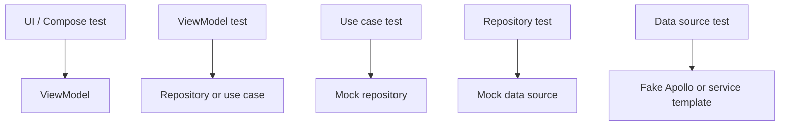

# Digital Collections Testing Strategy

Back to [[Digital Collections Android Learning Hub]].

Related notes:

- [[Collectible testing rules]]
- [[Collectibles Architecture and Best Practices]]
- [[Digital Collections Data Layer and APIs]]
- [[Digital Collections ViewModels and UDF]]

## Mental Model

Test Digital Collections by layer. Mock below the layer you are testing, and assert the behavior exposed by that layer.



## Main Test Locations

Implementation unit tests:

`digitalCollections/digitalCollectionsImpl/src/test/`

Implementation android tests:

`digitalCollections/digitalCollectionsImpl/src/androidTest/`

Public test support:

`digitalCollections/digitalCollectionsTestSupport/`

Internal android test helper:

`digitalCollections/digitalCollectionsInternalTestHelper/`

Graded card tests:

`digitalCollections/digitalCollectionsGradedCard/src/test/`

## Common Test Stack

Digital Collections tests commonly use:

- JUnit
- Robolectric
- MockK
- Turbine
- coroutine test rules
- `InstantTaskExecutorRule`
- Compose test APIs
- Dagger test components
- fake Apollo/data-source modules
- page-object helpers for UI tests

## Testing By Layer

### ViewModel Tests

Use ViewModel tests to verify:

- initial state
- state transitions after events
- repository/use-case calls
- side effects
- loading/error/success behavior
- analytics/tracking calls when relevant

Typical setup:

```text
Mock dependencies
Create ViewModel
Send event through handleEvent
Assert viewState and sideEffects
Verify important dependency calls
```

Good examples to inspect:

- tests under `digitalCollections/digitalCollectionsImpl/src/test/java/com/ebay/mobile/digitalcollections/impl/viewmodel/`
- tests near feature packages such as `unifiedPriceGuidance/`, `cashInTheAttic/`, `view/`, and `inventoryGrid/`

Common gotcha:

- If the ViewModel uses `UdfScaffold`, test both persistent `viewState` and one-time `sideEffects`.

### Use Case Tests

Use case tests should be small and direct.

Use them to verify:

- orchestration logic
- transformation rules
- feature decisions
- repository interaction order when meaningful
- edge cases independent of Android UI

Typical setup:

```text
Mock repository
Instantiate use case
Call invoke/function
Assert result
Verify repository interactions if behavior depends on them
```

Use case code usually lives under:

- `digitalCollections/digitalCollectionsImpl/src/main/java/com/ebay/mobile/digitalcollections/impl/usecase/`
- feature-specific `usecase/` packages
- `digitalCollections/digitalCollectionsGradedCard/.../usecase/`

### Repository Tests

Repository tests verify how repositories consume data sources and expose feature-ready data.

Use them to verify:

- `Flow<AsyncState<T>>` emissions
- `Outcome<T>` handling
- mapping from raw API result to domain model
- error behavior
- hybrid GraphQL/Experience Service decisions

Typical setup:

```text
Mock data source or adapter
Create repository
Call repository function
Use Turbine or direct assertions
Assert emitted domain data
```

Common gotcha:

- Repositories should not leak generated API models unless that is explicitly the contract.

### Data Source Tests

Data source tests are closer to API boundaries.

GraphQL data source tests may use:

- test Apollo modules
- JSON fixtures
- fake `ApolloDataSource`
- Dagger `TestComponent`

Experience Service data source tests may use:

- mocked service templates
- fake service modules
- response fixtures
- adapter assertions

Important paths:

- `digitalCollections/digitalCollectionsImpl/src/test/java/com/ebay/mobile/digitalcollections/impl/dagger/TestComponent.kt`
- `digitalCollections/digitalCollectionsImpl/src/test/java/com/ebay/mobile/digitalcollections/impl/RobolectricTestApplication.kt`

### Compose UI Tests

Use Compose UI tests when you need confidence in rendering or UI interaction.

Test:

- visible text/content
- loading/empty/error states
- click behavior
- important accessibility behavior
- screen-specific layout decisions

Prefer page objects when tests become repetitive.

Common locations:

- feature-specific `src/test` packages
- page-object files near screen tests
- `digitalCollectionsInternalTestHelper` for shared UI helpers

## Test Support Modules

### digitalCollectionsTestSupport

Path:

`digitalCollections/digitalCollectionsTestSupport/`

Purpose:

- public fakes and stubs for tests outside the implementation module
- fake factories for public Digital Collections API contracts
- test Dagger support where external modules need a Digital Collections replacement

Use this when:

- another module needs to satisfy a Digital Collections API dependency in tests
- the fake should be safe and reusable outside `digitalCollectionsImpl`

### digitalCollectionsInternalTestHelper

Path:

`digitalCollections/digitalCollectionsInternalTestHelper/`

Purpose:

- internal androidTest support
- Dagger test modules
- Espresso helpers
- page-object utilities
- stubs for platform dependencies

Use this when:

- the helper is specific to Digital Collections integration/UI tests
- the code should not become part of the public test API

## Dagger Test Graphs

Digital Collections has test-specific Dagger setup for integration-style unit tests and android tests.

Unit/integration-style test graph:

- `digitalCollections/digitalCollectionsImpl/src/test/java/.../dagger/TestComponent.kt`
- `digitalCollections/digitalCollectionsImpl/src/test/java/.../RobolectricTestApplication.kt`

androidTest graph:

- `digitalCollections/digitalCollectionsImpl/src/androidTest/java/.../DigitalCollectionsAndroidTestComponent.kt`
- `digitalCollections/digitalCollectionsImpl/src/androidTest/java/.../DigitalCollectionsAndroidTestModule.kt`

Typical fake module responsibilities:

- replace repositories
- replace navigation factories
- replace identity/session dependencies
- replace API/data-source dependencies
- provide fake image loading or content management

## What To Mock

| Test target | Usually mock |
| --- | --- |
| Composable screen | callbacks and static ViewState |
| ViewModel | repositories, use cases, trackers, dispatchers |
| Use case | repositories |
| Repository | data sources and adapters |
| Data source | network/service templates or Apollo test modules |
| Dagger wiring | use test modules/fakes rather than local mocks |

## What To Assert

| Layer | Assert |
| --- | --- |
| Screen | rendered content and callback invocation |
| ViewModel | state, effects, dependency calls |
| Use case | returned domain result and edge cases |
| Repository | mapped domain data and error handling |
| Data source | request/response mapping and API error handling |
| Integration/androidTest | feature behavior through a realistic graph |

## Fixture Patterns

Common fixture names:

- `*DummyData.kt`
- `*TestData.kt`
- JSON resources for GraphQL/API responses
- fake repositories under androidTest packages
- page objects for complex UI flows

Fixture rule:

```text
Keep fixture names tied to domain behavior, not implementation accidents.
```

## When To Add Tests

Add or update tests when:

- a ViewModel state transition changes
- a repository mapping changes
- GraphQL or Experience Service response handling changes
- Dagger bindings are added or moved
- a screen flow gains new navigation/effect behavior
- a migration changes API source of truth

For low-risk documentation-only work, tests are not needed.

## Common Gotchas

- Do not only test the happy path for repository/API mapping.
- Do not assert implementation details that make refactors painful.
- Do not use androidTest when a fast unit or Robolectric test gives the same confidence.
- Do not mock the class under test; mock its dependencies.
- If Dagger generated code is involved, run or rely on a compile path that exercises annotation processing.
- Keep public test fakes in `digitalCollectionsTestSupport`; keep internal UI/integration helpers in `digitalCollectionsInternalTestHelper`.

