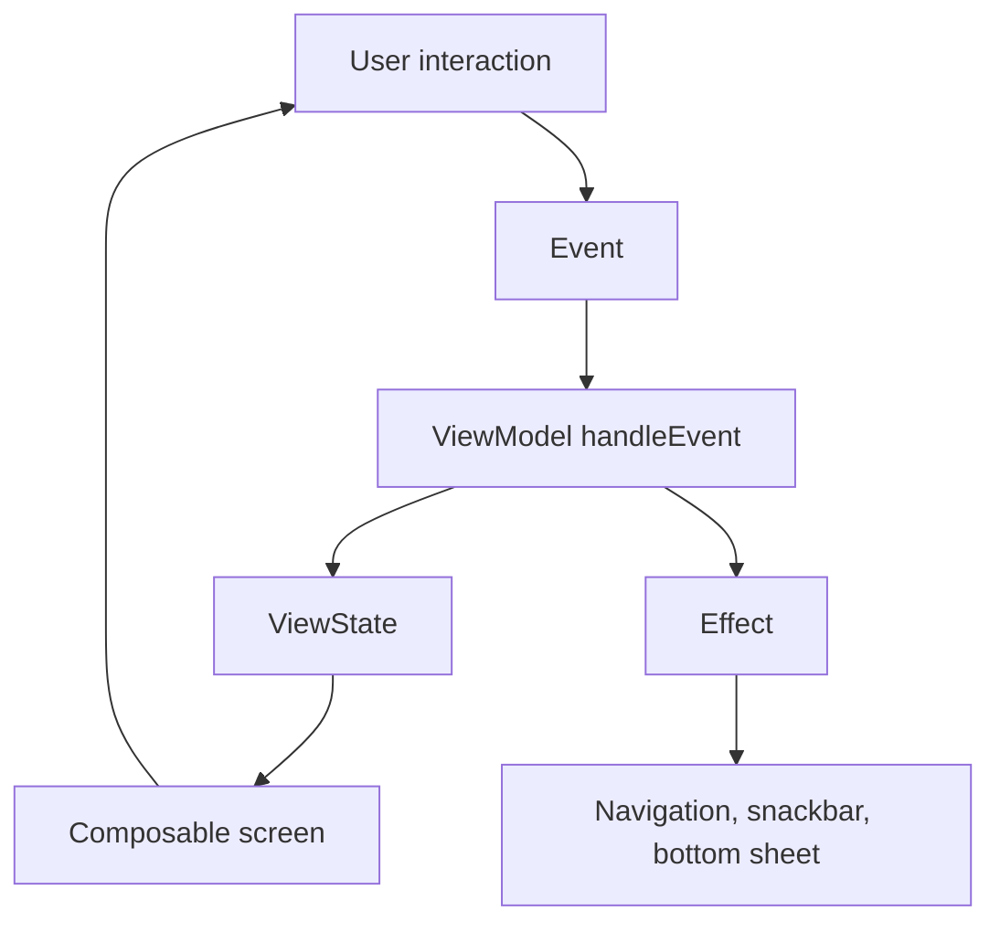
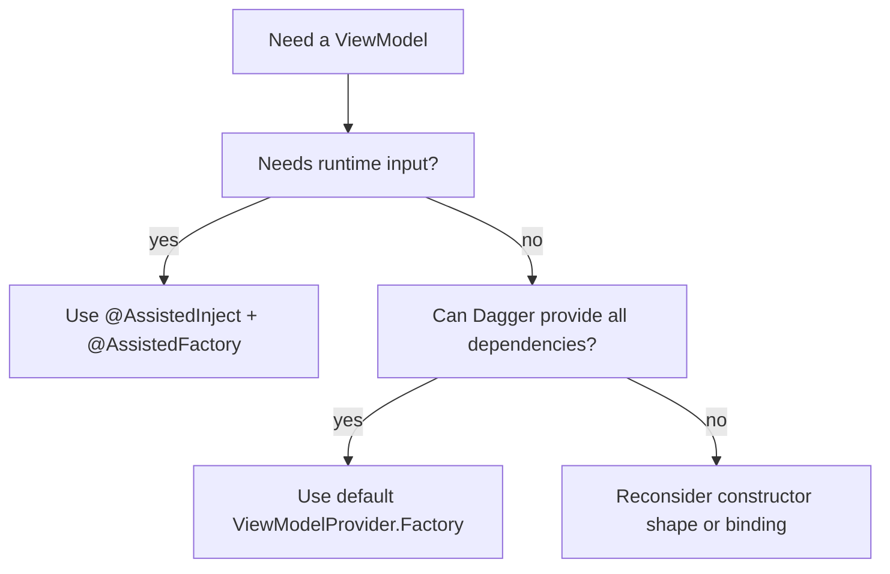

# Digital Collections ViewModels and UDF

Back to [[Digital Collections Android Learning Hub]].

Related notes:

- [[Digital Collections Navigation and Screen Flow]]
- [[Digital Collections Dagger Assisted ViewModel Flow]]
- [[Collectibles Architecture and Best Practices]]

## Mental Model

Most modern Digital Collections screens follow unidirectional data flow:

```text
User action
    -> Event
    -> ViewModel.handleEvent
    -> State update and/or side effect
    -> Screen recomposes or reacts once
```

In code, this commonly appears as:

```text
ViewState + Event + Effect + UdfScaffold
```

## UDF Shape



## The Common ViewModel Pattern

Many ViewModels implement `UdfScaffold` using delegation:

```kotlin
class XViewModel : ViewModel(),
    UdfScaffold<XViewState, XEvent, XEffect> by udfScaffold(
        initialState = XViewState(...)
    ) {
    override fun handleEvent(event: XEvent) {
        when (event) {
            // event handling
        }
    }
}
```

Look for imports from:

```kotlin
com.ebay.mobile.businesscomponent.businessComponentUdfScaffold.UdfScaffold
com.ebay.mobile.businesscomponent.businessComponentUdfScaffold.udfScaffold
```

Good examples:

- `digitalCollections/digitalCollectionsImpl/src/main/java/com/ebay/mobile/digitalcollections/impl/viewmodel/archive/ArchiveCollectibleViewModel.kt`
- `digitalCollections/digitalCollectionsImpl/src/main/java/com/ebay/mobile/digitalcollections/impl/view/folderSelection/FolderSelectionViewModel.kt`
- `digitalCollections/digitalCollectionsImpl/src/main/java/com/ebay/mobile/digitalcollections/impl/view/collectibleActivity/CollectibleActivityViewModel.kt`
- `digitalCollections/digitalCollectionsImpl/src/main/java/com/ebay/mobile/digitalcollections/impl/view/collectionSummary/ui/CollectionSummaryViewModel.kt`

## ViewState

ViewState represents everything the screen needs to render.

Common conventions:

- prefer immutable `data class` state
- use `@Immutable` for Compose state objects when appropriate
- include a `UiState` or loading/error field when the screen has async work
- avoid putting Android framework objects in ViewState unless necessary
- keep state close to the screen's rendering needs

Example shape:

```kotlin
@Immutable
data class ArchiveCollectiblesViewState(
    val uiState: UiState,
    val cards: List<ArchiveCollectibleSection>,
)
```

When to add to ViewState:

- the UI renders it
- the UI enables/disables behavior from it
- it survives recomposition as screen state

When not to add to ViewState:

- one-time navigation commands
- one-time snackbars
- repository objects
- raw response models that still need transformation

## Events

Events represent user or lifecycle actions coming into the ViewModel.

Example shape:

```kotlin
sealed interface ArchiveCollectibleEvent {
    data object Initialize : ArchiveCollectibleEvent
    data object TrackPageView : ArchiveCollectibleEvent
    data class FieldUpdated(...) : ArchiveCollectibleEvent
    data class Submit(...) : ArchiveCollectibleEvent
}
```

Use events for:

- initialization
- button taps
- form changes
- retry actions
- page-view tracking
- menu selections

Common gotcha:

- Do not call repositories directly from composables. Send an event to the ViewModel.

## Effects

Effects represent one-time actions that should not live permanently in ViewState.

Examples:

- navigate back
- show snackbar
- open bottom sheet
- show toast
- launch external action

Example shape:

```kotlin
sealed interface ArchiveCollectibleEffect {
    data class ArchiveCollectiblesFinished(
        val toastMessage: UiText,
    ) : ArchiveCollectibleEffect
}
```

The screen wrapper usually collects effects in `LaunchedEffect`:

```kotlin
LaunchedEffect(sideEffects) {
    sideEffects.collect { effect ->
        // handle one-time effect
    }
}
```

## Screen Wrapper Pattern

Destination wrappers usually do three things:

1. create or obtain the ViewModel
2. collect `viewState`
3. pass state, effects, and event handler into a stateless screen composable

Example:

```kotlin
val viewModel = viewModel {
    viewModelFactory.create(createSavedStateHandle())
}
val viewState by viewModel.viewState.collectAsStateWithLifecycle()

ArchiveCollectiblesScreen(
    viewState = viewState,
    sideEffects = viewModel.sideEffects,
    handleEvent = viewModel::handleEvent,
)
```

The screen composable should not know how the ViewModel was created.

## Default Factory vs Assisted Factory

Digital Collections uses two main ViewModel creation strategies.

### Default Dagger ViewModel Factory

Use when Dagger can provide the whole constructor.

Example binding:

```kotlin
@[Binds IntoMap ViewModelKey(TabHostViewModel::class)]
abstract fun bindsTabHostViewModel(instance: TabHostViewModel): ViewModel
```

Usage:

```kotlin
val viewModel: TabHostViewModel = viewModel(factory = viewModelFactory.default)
```

Good fit:

- constructor has only Dagger-provided dependencies
- no runtime route args are needed
- no custom object needs to be passed from the screen

### Assisted ViewModel Factory

Use when the ViewModel needs runtime values.

Example:

```kotlin
class ArchiveCollectibleViewModel @AssistedInject constructor(
    @Assisted private val savedStateHandle: SavedStateHandle,
    private val archiveOperationUseCase: ArchiveOperationUseCase,
    private val tracker: CollectibleTrackingHelper,
) : ViewModel()
```

Factory:

```kotlin
@AssistedFactory
interface Factory {
    fun create(savedStateHandle: SavedStateHandle): ArchiveCollectibleViewModel
}
```

Usage:

```kotlin
val viewModel = viewModel {
    viewModelFactory.create(createSavedStateHandle())
}
```

Good fit:

- the ViewModel needs a `SavedStateHandle`
- the screen must pass runtime route args
- the screen has a feature-provided data provider or runtime object
- Dagger can provide the stable dependencies but not every constructor value

## Decision Tree



## Activity-Scoped vs Destination-Scoped

Some ViewModels are created high in `DigitalCollectionsNavigation.kt`, then shared through the container and NavHost. This supports activity-level concerns, but it can also make state live too long.

Activity-scoped examples:

- `CollectibleActivityViewModel`
- `TabHostViewModel`
- `CollectionSummaryViewModel`
- `CollectionSettingsViewModel`
- `QuickEditBottomSheetViewModel`
- `CollectibleSplashViewModel`

Destination-scoped examples:

- `ArchiveCollectibleViewModel`
- `FolderSelectionViewModel`
- `CreateRenameFolderViewModel`
- `ManualAddEditCollectibleViewModel`

Rule of thumb:

- If state belongs to one screen, scope it to that screen destination.
- If state controls activity chrome or shared overlays, activity scope may be appropriate.

## When To Use This Pattern

Use ViewState/Event/Effect when:

- the screen has user actions
- the screen performs async work
- the screen has one-time side effects
- the screen needs testable presentation logic

Use plain composable state when:

- the state is purely local UI state
- no ViewModel or repository interaction is needed
- the state does not need to survive process death or screen recreation

## Common Gotchas

- Do not put one-time effects in persistent ViewState.
- Do not let child composables call ViewModel methods directly; pass lambdas.
- Do not add `SavedStateHandle` as a normal Dagger dependency when it is route-specific. Use assisted injection or the repo's `ViewModelFactory` pattern.
- Do not hoist ViewModels to activity scope just to make callbacks easier.
- Watch for docs that say `CollectiblesScaffold`; current code commonly uses `UdfScaffold`.

